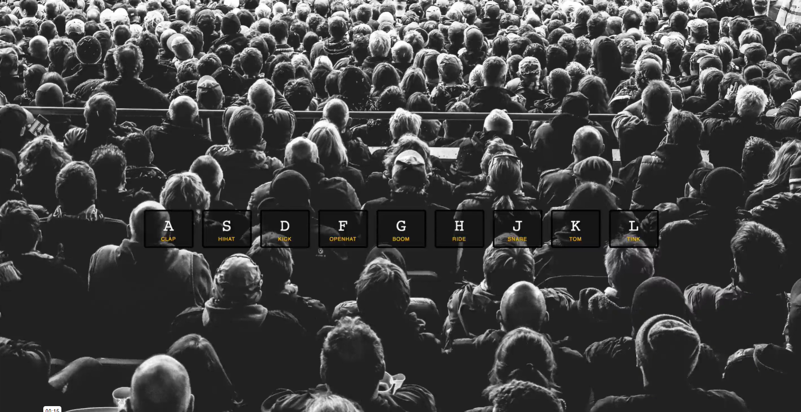
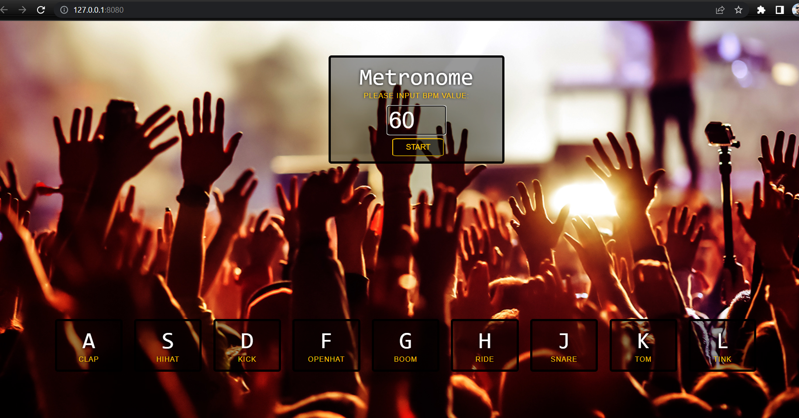
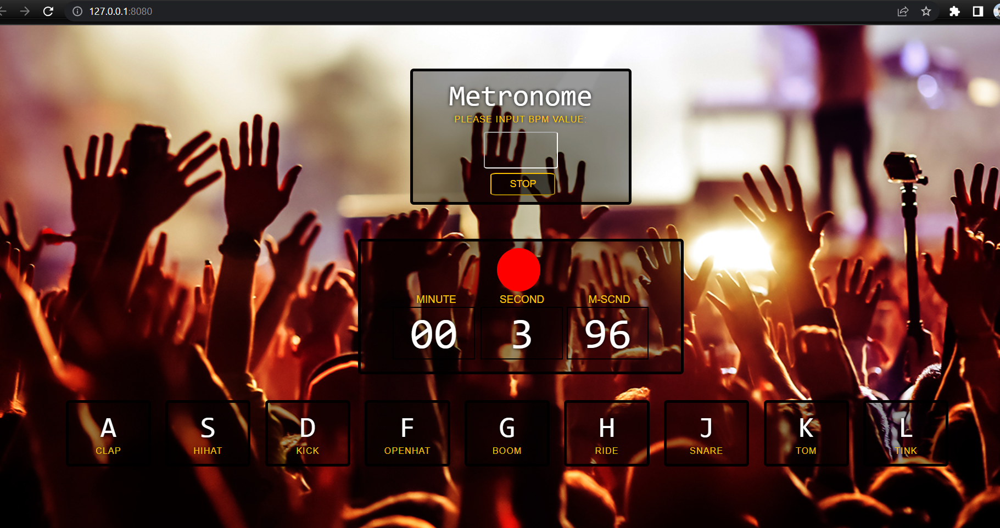

# Description

This project includes the updated version of the **JS 30 Drum-Kick application** by me. I have added a metronome and timer to the base version. I hope you gonna like this version. 

# How Works?

You can create your own music using this application. Just only hit your keywords. 
If you want to play a specific tempo you can utilize the metronome.

# View of the application

* The base version: 

* V2  

* V2 when the user starts the metronome

